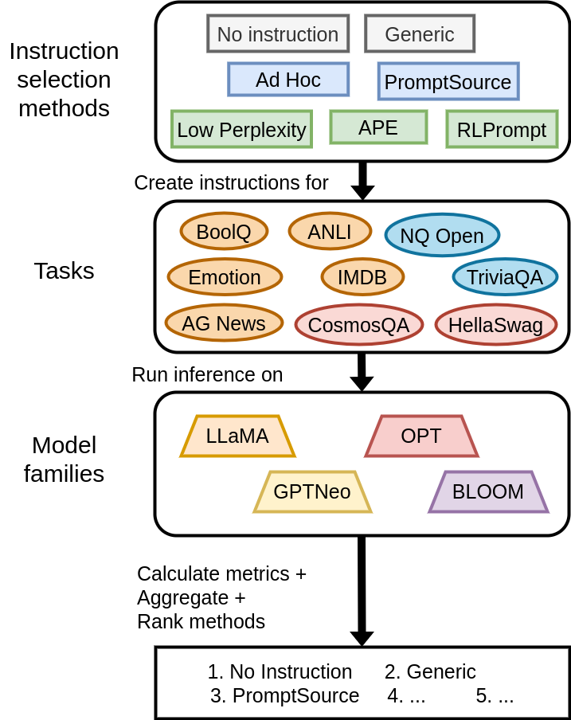

# InstructEval: Systematic Evaluation of Instruction Selection Methods

We release the evaluation suite used in our paper [`InstructEval: Systematic Evaluation of Instruction Selection Methods`](https://arxiv.org/abs/2307.00259). 



<br>

The suite allows the evaluation of arbitrary instructions and prompt templates across a set of 13 open-sourced LLM for varying scales from 4 model families, and covers 9 different tasks spanning 3 task types. The suite allows evaluation along 3 accuracy metrics 
* zero-shot accuracy
* few-shot accuracy 
* perturbation accuracy 

and 2 sensitivity metrics 
* selectional sensitivity 
* permutational sensitivity.
## Install
This evaluation suite demands `torch==1.12.1` to ensure compatibility with `crfm_helm`. You will also need `transformers>=4.28.1` to ensure compatibility with the LLaMA models.

Set up a new Python 3.9 environment and install [PyTorch 1.12.1](https://pytorch.org/get-started/previous-versions/#v1121).
```bash
pip install -r requirements.txt --no-deps
```

## Usage
We provide a script that can be used to evaluate a single instruction on a single model and a single task, along a single metric. 
 To evaluate an instruction on a specific model and task along a metric, use `evaluate_instruction.py`.
```bash
python3 -m evaluate_instruction --instructions_dir INSTRUCTIONS_DIR --index INDEX --model MODEL --dataset DATASET --metric_config METRIC_CONFIG [--decoder DECODER] [--prompt_template_dir PROMPT_TEMPLATE_DIR] [--results_dir RESULTS_DIR]
```

### Arguments

* `--instructions_dir` (required): Path to the directory containing instruction files. These files should be named based on the dataset they correspond to (eg. `ag_news.yaml`).
* `--index` (required): Index of the instruction to evaluate in the dataset's instruction file. This should be an integer.
* `--model` (required): Identifier of the model to use during evaluation.
* `--dataset` (required): Identifier of the dataset to be used for evaluation.
* `--metric_config` (required): Path to the metric configuration file which specifies both the name of the metric to evaluate along, and relevant hyperparameters.
* `--decoder` (optional): Name of the decoder. If specified, the script will use this decoder for the evaluation. If not, the script will use the default decoder for the specified dataset.
* `--prompt_template_dir` (optional, default: "configs/default_prompts"): Path to the directory containing Jinja2 prompt templates for each dataset.
* `--results_dir` (optional, default: "results/"): Path to the directory where the script should write the results.

### Example usage:
```bash
python3 -m evaluate_instruction --instructions_dir instructions/ape --index 2 --model opt13b --dataset cosmos_qa --metric_config configs/metric/perturbational_accuracy_defaults.yaml
```
### Aggregating results
Results are written to a directory specified by `--results_dir` in the form of JSON files. Users can aggregate results across any desirable axes and aggregation strategies by writing custom scripts. We provide sample code for the aggregations we perform in our paper in `notebooks/aggregate_results.ipynb`. 

-------
### Prompts
Instructions to be evaluated can be set to arbitrary strings obtained using any external means. They are to be specified as entries in YAML files named after task they correspond to (such as those in `instructions/ape/`). A specific instruction from this list can be evaluated by appropriately setting the `--index` parameter of `evaluate_instruction.py`.

To evaluate a new instruction selection method, create a new directory under `instructions/` following the file-tree structure of the provided sample instructions. We support the evaluation of both model-agnostic instructions as in `instructions/ape` and model-specific instructions as in `instructions/low_perplexity_prompts`. You can then directly use `evaluate_instruction.py` as described above.

Evaluations can also be conducted using arbitrary prompt templates expressed using the Jinja2 templating engine (as in `configs/default_prompts/`). Non-default prompt-templates can be specified using `--prompt_template_dir`.


### Metrics configs

Metric configuration files are expected in YAML format and must specify both the name of the required metric, and the relevant hyperparameters. We provide example configuration files for each of the 5 metrics under `configs/metric/`. 

### Decoders
We include 4 choices of decoders with the codebase that can be used in conjunction with any supported model.
* `ConstrainedLabelGeneration`: Intended to be used with CLS tasks with fixed, static label-spaces.
* `ConstrainedPerExampleLabelGeneration`: Intended to be used with MCQ tasks whose label-space varies across test examples.
* `GreedyGeneration`: For use with GQA tasks with unconstrained label-spaces. Implements Greedy Sampling.
* `NucleusGeneration`: For use with GQA tasks with unconstrained label-spaces. Implements Nucleus Sampling.
  
We do not implement any form of calibration in these decoders. As a user, you can straightforwadly implement new custom decoders by extending the `Decoder` class.


### Supported Models
We support 13 models with sizes ranging from 1 billion to 20 billion parameters, across 4 model families.
| model family | identifiers |
|:------------:|:------------|
| BLOOM        | `bloom1b1`, `bloom1b7`, `bloom3b`, `bloom7b1` |
| GPT Neo*     | `gptneo1b3`, `gptneo2b7`, `gptneox20b` |
| LLaMA        | `llama7b`, `llama13b` |
| OPT          | `opt1b3`, `opt2b7`, `opt6b7`, `opt13b` |

### Supported Tasks
We include support for 9 tasks across classification (CLS), multiple-choice question-answering (MCQ) and generative question-answering (GQA).
| Task | Task type | identifier |
|:----:|:---------:|:-----------|
| AG News | CLS | `ag_news` |
| ANLI | CLS | `anli` |
| BoolQ | CLS | `boolq` |
| IMDB | CLS | `imdb` |
| TweetEval Emotion | CLS | `tweet_emotion` |
| HellaSwag | MCQ | `hellaswag` |
| CosmosQA | MCQ | `cosmos_qa` |
| NaturalQuestions Open | GQA | `nq_open` |
| TriviaQA | GQA | `trivia_qa` |

## Questions?
Feel free to contact `anirudh.ajith@princeton.edu` or `chris.pan@princeton.edu` if you have any questions about the evaluation suite, or our paper!

## Citation
```bibtex
@misc{ajith2023instructeval,
      title={InstructEval: Systematic Evaluation of Instruction Selection Methods}, 
      author={Anirudh Ajith and Chris Pan and Mengzhou Xia and Ameet Deshpande and Karthik Narasimhan},
      year={2023},
      eprint={2307.00259},
      archivePrefix={arXiv},
      primaryClass={cs.CL}
}
```
